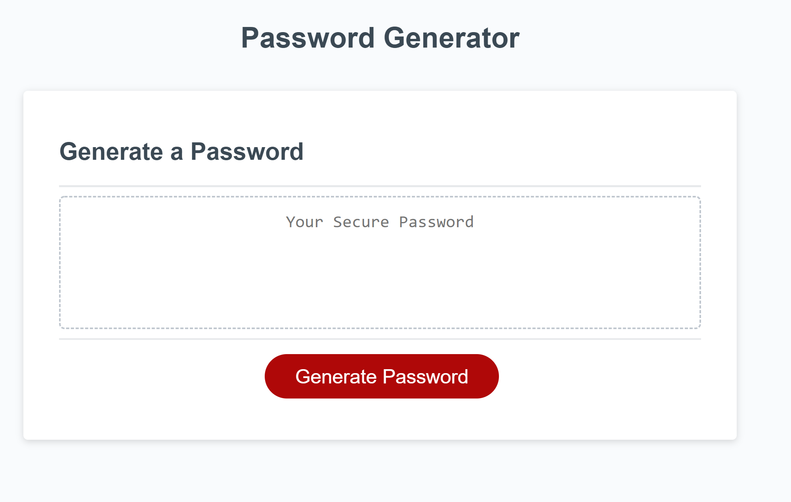
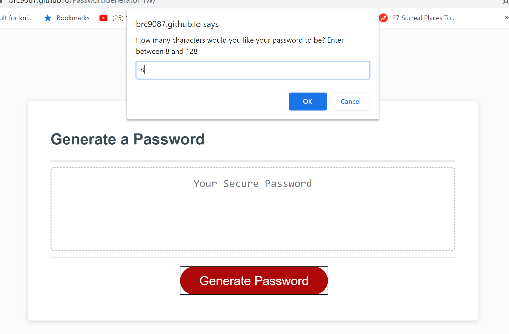
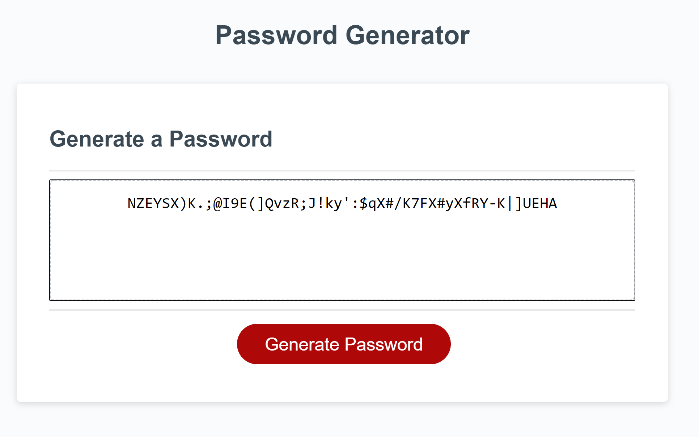

# Password Generator

* This is a random password generator app! The app will ask the user a series of questions:
1. length of password (numeric input)
2. validate length is between 8 and 128.
3. type of characters to include - special characters uppercase, lowercase, numeric(series of yes/no confirms)
4. Validate the user selected at least one character type.

## Usage / Directions
* Click the link to create a generate a random password! ==> https://brc9087.github.io/PasswordGeneratorHW/

## Home Page
* 

 

## Prompts / Preferences
* 

 
    
## Generated Password
*  

 

## Tools Used / Dependancies
--
* JS
* HTML
* CSS

## Links
* APP: https://brc9087.github.io/PasswordGeneratorHW/ -->
* REPO: https://github.com/brc9087/PasswordGeneratorHW
